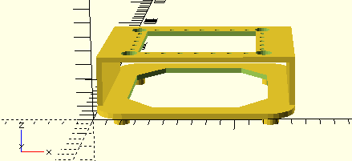

# dac-amp_3D-support
This repo contains a [3D model](https://github.com/Amodio/dac-amp_3D-support/releases/download/v1/snd_support.stl) with its [OpenSCAD script](https://github.com/Amodio/dac-amp_3D-support/blob/main/snd_support.scad), for stacking the amp Douk Audio A5 on top of a DAC: FiiO K11 (R2R).

**You can stack the two devices without this support**, but it provides some space/air to breath in between (and underneath).

## Audio setup
This is a good audio system for a contained budget:
  - [FiiO K11 R2R](https://fr.aliexpress.com/item/1005007640762374.html) 129,75 €
  - [Douk Audio A5](https://fr.aliexpress.com/item/1005008340455661.html) 65,49 €
  - [RCA pair](https://fr.aliexpress.com/item/1005006382579654.html) 1,82 €
  - [Banana cables 2m](https://fr.aliexpress.com/item/1005001413726456.html) 9,59 €
  - [Banana cables 1m](https://fr.aliexpress.com/item/1005006780979882.html) 6,79 €
  - [Micca MB42X G2 speakers](https://www.amazon.fr/dp/B0CGBKWBGM) 114,99 €

Total: __328,43 €__

## Notes
If you do not have a 3D printer (my Ender 3 v2 was 200 €), online services (PCBWay, CraftCloud, Sculpta, etc.) can print it for under 30 €.
Add ~3 € more for [10mm non-slip pads](https://fr.aliexpress.com/item/1005008617276107.html).

It takes ~8 hours and 150 grams of material to print (with a raft support in Cura), that's about 2,5 €; [PETG](https://www.amazon.fr/dp/B0CSFW9XTN) is recommanded (but PLA works aswell).

